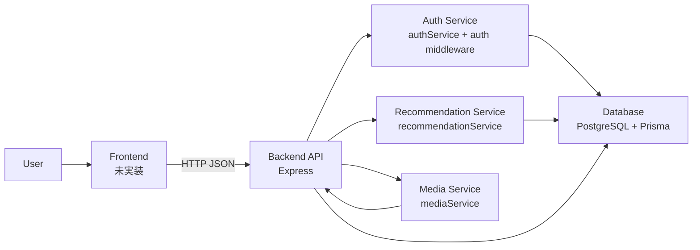

# 01. システム全体像

## アプリの目的

Yorimo は「寄り道マッピングSNS」です。ユーザーの日常ルート、現在地、空き時間、予算、気分、興味タグ、過去の反応をもとに、カフェ、レストラン、ジム、サウナ、映画館、買い物スポットなどの寄り道先を提案します。

同時に、スポットに紐づく写真、ショート動画、ストーリー、一言レビューを投稿できるSNS機能を持ちます。現在のリポジトリではバックエンドAPIが実装済みで、フロントエンドアプリは未実装です。

## 解決する課題

- 通学、通勤、移動中に「近くでちょうどよく寄れる場所」を探しにくい
- 通常の地図検索では、ユーザーの趣味、気分、予算、空き時間、過去の行動が十分に反映されない
- SNS投稿と地図上のスポット情報が分断され、実際に寄り道する判断材料が散らばる
- 高校生を含む若いユーザーにとって、安全性や公開範囲を考慮したスポット投稿体験が必要

## 主要ユーザー

- 学校帰りに短時間で寄れるカフェや買い物先を探したい高校生、大学生
- 仕事帰りにジム、サウナ、食事、映画などに寄りたい社会人
- 趣味や気分に合う新しいスポットを探したいユーザー
- 実際に訪れたスポットの雰囲気を写真、短文レビュー、ストーリーで共有したいユーザー

## 主要機能

| 機能 | 現在の実装状況 | 説明 |
| --- | --- | --- |
| 認証 | 実装済み | `POST /api/auth/register`、`POST /api/auth/login`、JWT認証 |
| プロフィール | 実装済み | `GET /api/auth/me`、`PATCH /api/auth/me` で名前、年齢帯、駅、興味、予算を扱う |
| マイルート登録 | 実装済み | `Route` モデルと `/api/routes` CRUD |
| スポット検索 | 実装済み | カテゴリ、タグ、予算、キーワード、現在地半径で検索 |
| 寄り道推薦 | 実装済み | `recommendationService` によるMVPルールベース推薦 |
| 投稿 | 実装済み | `Post` モデルと `/api/posts` CRUD |
| フィード | 実装済み | `GET /api/feed` でpublic投稿を取得し、ブロック関係を除外 |
| 保存 | 実装済み | `SavedSpot` と `/api/saved-spots`、feedbackの `save` でも保存 |
| フィードバック | 実装済み | `Feedback` に `view/save/skip/visited/like/dislike/report` を保存 |
| 通報 | 実装済み | `Report` と `POST /api/reports` |
| ブロック | 実装済み | `Block` と `POST /api/blocks`、`DELETE /api/blocks/:blockedUserId` |
| フォロー | 未実装 | `Visibility.followers` enumはあるが、フォロー関係テーブルは未実装 |
| メディアアップロード | 未実装 | 現在は `mediaUrl` をそのまま保存するだけ |
| 外部地図API | 未実装 | Google Maps等との連携は今後の想定 |

## システム全体図

現在の実装では、フロントエンドはこのリポジトリに含まれていません。バックエンドAPIは `src/app.ts` で Express アプリとして構成され、`/api` 配下にルーティングされます。

`Auth Service` は `src/services/authService.ts` と `src/middlewares/auth.ts` の組み合わせです。`Recommendation Service` は `src/services/recommendationService.ts` に実装されています。`Media Service` は将来S3やCloudinaryへ置き換えるための薄い抽象で、現時点では `mediaUrl` をそのまま返します。
