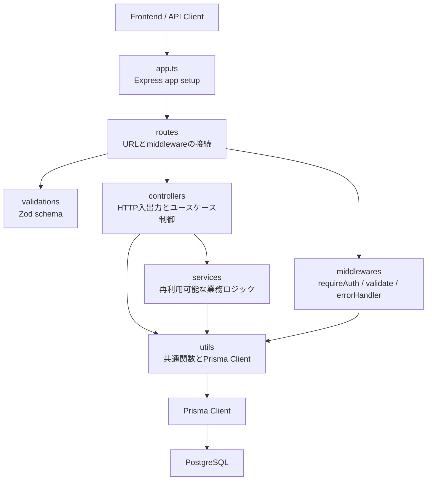

# 02. アーキテクチャ

## 採用技術

| 領域 | 技術 |
| --- | --- |
| Runtime | Node.js 20+ |
| Language | TypeScript、ES Modules |
| Web Framework | Express |
| ORM | Prisma Client |
| Database | PostgreSQL 16 |
| Auth | bcryptjs、jsonwebtoken |
| Validation | Zod |
| Security Middleware | helmet、cors |
| Logging | morgan |
| API Docs | swagger-ui-express、`src/config/openapi.ts` |
| Testing | Vitest、Supertest |
| Dev tooling | tsx、Docker Compose |

## ディレクトリ構成

```text
.
├── prisma/
│   ├── schema.prisma
│   ├── seed.ts
│   └── migrations/
├── src/
│   ├── app.ts
│   ├── server.ts
│   ├── config/
│   ├── controllers/
│   ├── middlewares/
│   ├── routes/
│   ├── services/
│   ├── types/
│   ├── utils/
│   └── validations/
├── docs/
│   └── api.md
├── tests/
│   └── app.test.ts
└── .docs/
```

`dist/` は TypeScript ビルド成果物です。設計上のソースは `src/` と `prisma/` を参照します。

## レイヤー構成



## 各レイヤーの責務

| レイヤー | 主なファイル | 責務 |
| --- | --- | --- |
| app | `src/app.ts` | helmet、CORS、JSON parser、Swagger、ルーティング、エラーハンドラの登録 |
| server | `src/server.ts` | `env.PORT` でHTTPサーバーを起動 |
| routes | `src/routes/*.ts` | URL、HTTP method、認証要否、Zod validation、controllerを結びつける |
| controllers | `src/controllers/*.ts` | リクエスト値を使ってDB操作やservice呼び出しを行い、レスポンスを返す |
| services | `src/services/*.ts` | 認証、推薦、メディアURL解決、タグ同期など再利用されるロジック |
| middlewares | `src/middlewares/*.ts` | JWT認証、Zod parse、404、例外変換 |
| validations | `src/validations/*.ts` | body、query、paramsの入力仕様 |
| utils | `src/utils/*.ts` | `sendSuccess`、`sendError`、`AppError`、地理距離計算、Prisma Client |
| prisma | `prisma/schema.prisma` | DBスキーマ、enum、リレーション定義 |

## リクエスト処理の流れ

1. クライアントが `http://localhost:4000` にHTTPリクエストを送る
2. `app.ts` の共通middlewareが実行される
3. `/api` 配下は `apiRouter` に渡される
4. routeで必要に応じて `requireAuth` と `validateBody/validateQuery/validateParams` が実行される
5. controllerが Prisma Client や service を使って処理する
6. 成功時は `sendSuccess` が `{ success: true, data }` を返す
7. 例外時は `errorHandler` が `{ success: false, error }` に変換する

## この構成にしている理由

- routesでURLとmiddlewareを明確にし、認証要否とvalidationを見やすくしている
- controllersでHTTPレイヤーを扱い、共通処理は services と utils に逃がせる構成にしている
- ZodでAPI境界の型と制約を先に確定し、controller内の入力チェックを減らしている
- Prisma schemaを単一のDB仕様として扱い、migrationとTypeScript型を同期できる
- `sendSuccess` と `sendError` でフロントエンドが扱いやすい共通レスポンスにしている

## 現在の注意点

- `routeService`、`spotService`、`postService`、`feedbackService`、`savedSpotService`、`reportService`、`blockService` はまだ独立したserviceとしては未実装です。該当ロジックは controllers に直接置かれています。
- `Visibility.followers` はDB enumとvalidationには存在しますが、フォロー関係モデルは未実装です。
- `mediaService` はアップロード処理ではなく `mediaUrl` の受け渡しだけです。
- 認可は「自分のRoute」「自分のPost」など一部に実装済みですが、スポット作成・編集は現状ログインユーザーなら可能です。管理者ロールは未実装です。

## スケール時の拡張方針

- controllersから業務ロジックを `routeService`、`spotService`、`postService` へ分離する
- 検索・推薦負荷が高くなったら、スポット検索をPostgreSQLの地理拡張、Elasticsearch、ベクトルDBへ移す
- `mediaService` をS3、Cloudinary、署名付きURL発行に拡張する
- `authService` にrefresh token、logout、セッション失効を追加する
- 通報とモデレーションを管理画面、審査ステータス、監査ログへ拡張する
- recommendationServiceをルールベースからAI/ML推論サービスへ段階的に差し替える
