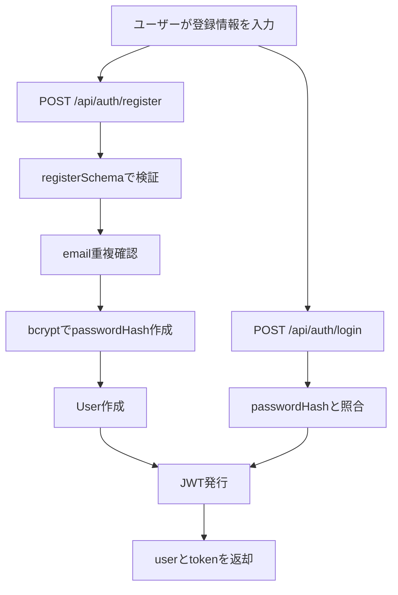
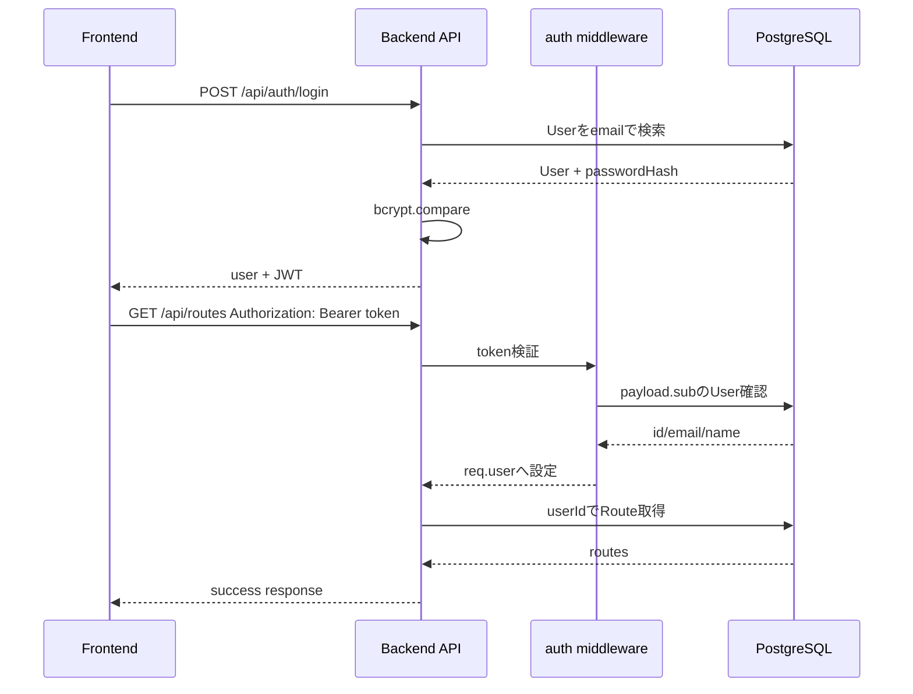
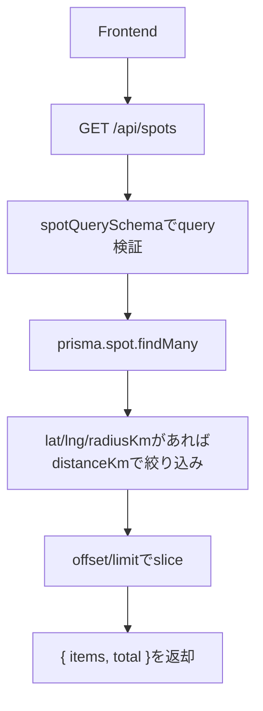
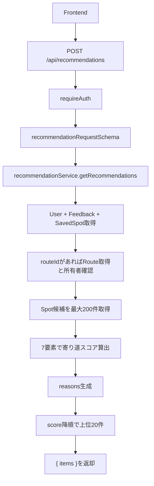
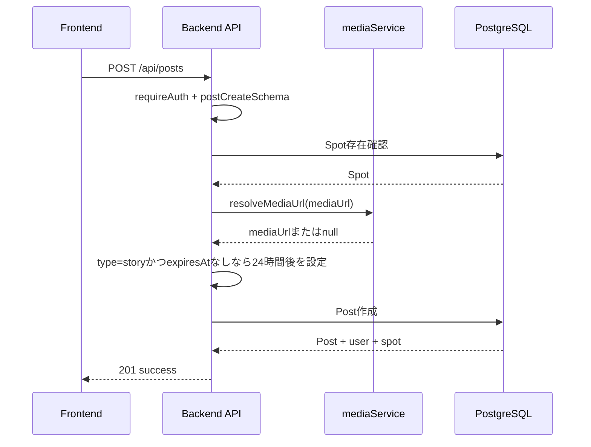
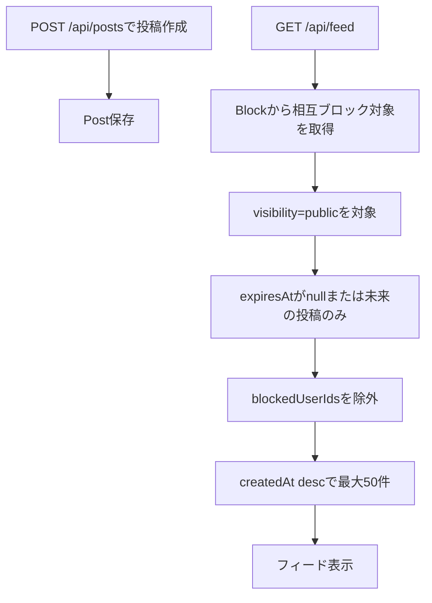
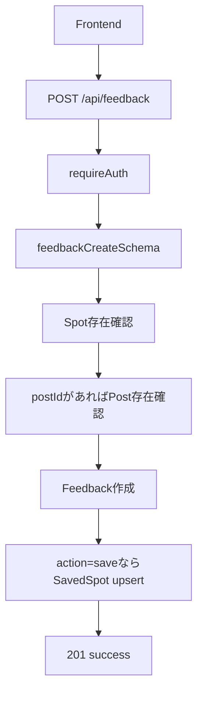

# 03. データフロー

このドキュメントでは、現在実装されているAPIの代表的なデータフローを説明します。フロントエンドは未実装ですが、APIクライアントから呼び出される前提で記述します。

## 1. ユーザー登録からログインまで

登録時は `name`、`email`、`password` が必須です。任意項目として `ageRange`、`homeStation`、`schoolOrWorkStation`、`interests`、`defaultBudgetMin`、`defaultBudgetMax` を保存できます。レスポンスの `user` には `passwordHash` は含まれません。

## 2. ログイン・認証API呼び出しフロー

認証が必要なAPIでは `Authorization: Bearer <token>` を送ります。tokenがない場合は `UNAUTHORIZED`、tokenが不正な場合は `トークンが無効です` が返ります。

## 3. スポット一覧取得のデータフロー

`GET /api/spots` は認証不要です。DB検索では `category`、`tag`、`minBudget`、`maxBudget`、`keyword` を使い、その後アプリ側で `lat/lng/radiusKm` による距離フィルタを行います。

## 4. 寄り道推薦取得のデータフロー

推薦は現在ルールベースです。ユーザーの興味、保存履歴、フィードバック履歴、現在地、任意のマイルート、空き時間、予算、気分を使って `yorimichiScore` を計算します。

## 5. 投稿作成のデータフロー

`photo`、`short_video`、`story`、`review` の投稿タイプを受け付けます。現時点ではファイルアップロードはなく、`mediaUrl` をURLとして受け取ります。

## 6. SNS投稿・フィード表示フロー

フィードはログイン必須です。自分がブロックしたユーザー、または自分をブロックしているユーザーの投稿を除外します。

## 7. フィードバック保存のデータフロー

`action` は `view`、`save`、`skip`、`visited`、`like`、`dislike`、`report` です。`save` の場合は `SavedSpot` も作成または維持され、推薦ロジックの行動履歴にも使われます。
