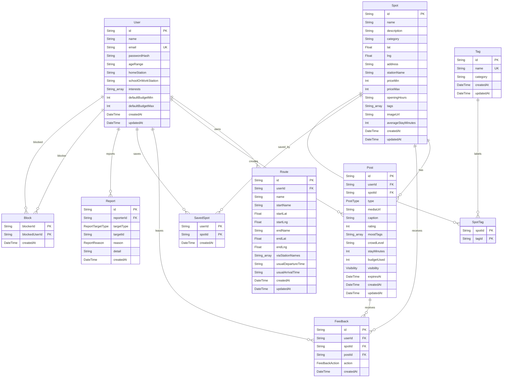

# 04. Database ER Diagram

このドキュメントは `prisma/schema.prisma` と初期migrationをもとにしたDB設計です。

## テーブル一覧

| モデル | 役割 |
| --- | --- |
| `User` | ユーザー、プロフィール、認証情報、興味タグ、デフォルト予算 |
| `Route` | ユーザーが登録する通学、通勤、日常移動ルート |
| `Spot` | 寄り道候補となるスポット |
| `Post` | スポットに紐づくSNS投稿 |
| `Feedback` | ユーザーの閲覧、保存、訪問、like/dislikeなどの反応 |
| `SavedSpot` | ユーザーが保存したスポット |
| `Report` | 投稿、ユーザー、スポットへの通報 |
| `Block` | ユーザー間ブロック |
| `Tag` | 正規化されたタグマスタ |
| `SpotTag` | `Spot` と `Tag` の中間テーブル |

## enum

| enum | 値 |
| --- | --- |
| `PostType` | `photo`, `short_video`, `story`, `review` |
| `Visibility` | `public`, `followers`, `private` |
| `FeedbackAction` | `view`, `save`, `skip`, `visited`, `like`, `dislike`, `report` |
| `ReportTargetType` | `post`, `user`, `spot` |
| `ReportReason` | `inappropriate`, `harassment`, `spam`, `location_privacy`, `other` |

## 主要カラム

### User

- `id`: cuid
- `name`: 表示名
- `email`: 一意
- `passwordHash`: bcrypt hash
- `ageRange`: 年齢帯
- `homeStation`: 自宅最寄り駅
- `schoolOrWorkStation`: 学校または勤務先の最寄り駅
- `interests`: 興味タグ配列
- `defaultBudgetMin`, `defaultBudgetMax`: 推薦に使うデフォルト予算

### Route

- `userId`: 所有ユーザー
- `startName`, `startLat`, `startLng`: 出発地点
- `endName`, `endLat`, `endLng`: 到着地点
- `viaStationNames`: 経由駅名配列
- `usualDepartureTime`, `usualArrivalTime`: 通常利用時間

### Spot

- `name`, `description`, `category`
- `lat`, `lng`: 緯度経度
- `address`, `stationName`
- `priceMin`, `priceMax`
- `openingHours`
- `tags`: 検索と推薦に直接使うタグ配列
- `imageUrl`
- `averageStayMinutes`

`Spot.tags` の配列と `SpotTag` の正規化リレーションが併存しています。現在の検索と推薦では主に `Spot.tags` 配列を使い、スポット作成・更新時に `tagService.syncSpotTags` が `Tag` と `SpotTag` を同期します。

### Post

- `userId`: 投稿者
- `spotId`: 紐づくスポット
- `type`: 投稿タイプ
- `mediaUrl`: 画像または動画URL
- `caption`, `rating`, `moodTags`, `crowdLevel`
- `stayMinutes`, `budgetUsed`
- `visibility`
- `expiresAt`: storyなど期限付き投稿に使用

### Feedback

- `userId`, `spotId`, `postId`
- `action`: ユーザー反応
- `createdAt`

`postId` は任意です。投稿が削除された場合は `onDelete: SetNull` です。

### SavedSpot

- 複合主キー: `userId`, `spotId`
- `createdAt`

同じユーザーが同じスポットを重複保存しない設計です。

### Report

- `reporterId`
- `targetType`, `targetId`
- `reason`, `detail`

`targetId` はポリモーフィック参照です。DB外部キーではなく、controllerで対象存在確認をしています。

### Block

- 複合主キー: `blockerId`, `blockedUserId`
- `createdAt`

`GET /api/feed` では、自分がブロックしたユーザーと自分をブロックしたユーザーをどちらも除外します。

## ER図

## リレーション設計

- `User` 削除時、`Route`、`Post`、`Feedback`、`SavedSpot`、`Report`、`Block` は cascade されます。
- `Spot` 削除時、`Post`、`Feedback`、`SavedSpot`、`SpotTag` は cascade されます。
- `Post` 削除時、`Feedback.postId` は `SetNull` になります。
- `SavedSpot`、`Block`、`SpotTag` は複合主キーで重複を防ぎます。
- `Feedback` は `userId/action` と `spotId` にindexがあります。
- `Report` は `targetType/targetId` にindexがあります。

## MVP時点の設計意図

- 推薦に必要なプロフィール、興味、保存、フィードバック、ルート情報を最小限のモデルで保持する
- スポット投稿を `Post` として独立させ、地図表示とSNSフィードの両方で使えるようにする
- `Feedback` を行動ログとして保存し、今後の推薦精度向上に使えるようにする
- 通報とブロックを初期からDBに持たせ、安全設計の拡張余地を残す
- `Tag` と `SpotTag` を用意しつつ、MVPでは `Spot.tags` 配列で検索とスコアリングを簡単に扱う

## 今後追加できるテーブル案

以下は未実装です。

| テーブル案 | 目的 |
| --- | --- |
| `Follow` | `followers` visibilityを正しく扱う |
| `MediaAsset` | 画像、動画、サムネイル、変換状態を管理 |
| `Notification` | like、コメント、フォロー、通報結果の通知 |
| `Comment` | 投稿へのコメント |
| `Like` | 投稿likeをFeedbackと分けて集計 |
| `RecommendationLog` | 推薦結果、スコア、クリック、訪問結果の分析 |
| `ModerationCase` | 通報対応、審査状態、管理者判断 |
| `AdminUser` または `Role` | 管理者権限 |
| `SpotAgeRestriction` | 年齢に合わないスポットの除外 |
| `RouteSegment` | 経由地点を緯度経度付きで詳細管理 |
