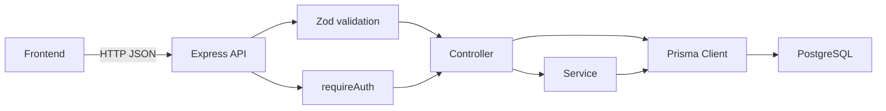

# 05. API Flow

## ベースURL

ローカル開発環境:

```text
http://localhost:4000
```

主な補助エンドポイント:

- `GET /health`
- `GET /openapi.json`
- `GET /api-docs`

アプリAPIは原則 `/api` 配下です。

## 共通レスポンス形式

成功:

```json
{
  "success": true,
  "data": {}
}
```

エラー:

```json
{
  "success": false,
  "error": {
    "code": "VALIDATION_ERROR",
    "message": "入力内容が正しくありません"
  }
}
```

`sendSuccess` と `sendError` により、フロントエンドは `success` を見て成功・失敗を分岐できます。

## 主なエラーコード

| code | HTTP status | 発生例 |
| --- | --- | --- |
| `VALIDATION_ERROR` | 400 | Zod validation失敗 |
| `BAD_REQUEST` | 400 | 自分自身をブロックしようとした場合など |
| `UNAUTHORIZED` | 401 | tokenなし、token不正、ユーザーなし |
| `FORBIDDEN` | 403 | 他人のRouteやPostへの操作 |
| `NOT_FOUND` | 404 | 対象データなし、存在しないpath |
| `CONFLICT` | 409 | email重複、一意制約違反 |
| `INTERNAL_SERVER_ERROR` | 500 | 未処理例外 |

## 認証が不要なAPI

- `GET /health`
- `GET /openapi.json`
- `GET /api-docs`
- `POST /api/auth/register`
- `POST /api/auth/login`
- `GET /api/spots`
- `GET /api/spots/:id`
- `GET /api/spots/:id/posts`

## 認証が必要なAPI

- `GET /api/auth/me`
- `PATCH /api/auth/me`
- `/api/routes` 配下すべて
- `POST /api/recommendations`
- `/api/posts` 配下すべて
- `GET /api/feed`
- `POST /api/feedback`
- `/api/saved-spots` 配下すべて
- `POST /api/reports`
- `POST /api/blocks`
- `DELETE /api/blocks/:blockedUserId`

認証方式は `Authorization: Bearer <JWT>` です。

## API呼び出し構成図



## 主要API一覧

### auth

| Method | Path | 認証 | 説明 |
| --- | --- | --- | --- |
| POST | `/api/auth/register` | 不要 | ユーザー登録。`user` と `token` を返す |
| POST | `/api/auth/login` | 不要 | ログイン。`user` と `token` を返す |
| GET | `/api/auth/me` | 必要 | ログイン中ユーザー取得 |
| PATCH | `/api/auth/me` | 必要 | プロフィール更新 |

### users/profile

独立した `/api/users` や `/api/profile` は未実装です。プロフィール操作は `/api/auth/me` に集約されています。

### routes

| Method | Path | 認証 | 説明 |
| --- | --- | --- | --- |
| GET | `/api/routes` | 必要 | 自分のマイルート一覧 |
| POST | `/api/routes` | 必要 | マイルート作成 |
| GET | `/api/routes/:id` | 必要 | 自分のマイルート詳細 |
| PATCH | `/api/routes/:id` | 必要 | 自分のマイルート更新 |
| DELETE | `/api/routes/:id` | 必要 | 自分のマイルート削除 |

### spots

| Method | Path | 認証 | 説明 |
| --- | --- | --- | --- |
| GET | `/api/spots` | 不要 | スポット検索 |
| GET | `/api/spots/:id` | 不要 | スポット詳細 |
| GET | `/api/spots/:id/posts` | 不要 | スポットに紐づくpublic投稿 |
| POST | `/api/spots` | 必要 | スポット作成 |
| PATCH | `/api/spots/:id` | 必要 | スポット更新 |
| DELETE | `/api/spots/:id` | 必要 | スポット削除 |

`GET /api/spots` のquery:

- `category`
- `tag`
- `minBudget`
- `maxBudget`
- `lat`
- `lng`
- `radiusKm`
- `keyword`
- `limit`
- `offset`

### recommendations

| Method | Path | 認証 | 説明 |
| --- | --- | --- | --- |
| POST | `/api/recommendations` | 必要 | 寄り道推薦を取得 |

必須入力は `currentLat`、`currentLng`、`availableMinutes` です。`routeId`、`budgetMin`、`budgetMax`、`mood`、`interestTags` は任意です。

### posts

| Method | Path | 認証 | 説明 |
| --- | --- | --- | --- |
| GET | `/api/posts` | 必要 | 投稿一覧。publicまたは自分のactive投稿 |
| POST | `/api/posts` | 必要 | 投稿作成 |
| GET | `/api/posts/:id` | 必要 | 投稿詳細。publicまたは自分のactive投稿 |
| PATCH | `/api/posts/:id` | 必要 | 自分の投稿のみ更新 |
| DELETE | `/api/posts/:id` | 必要 | 自分の投稿のみ削除 |

`GET /api/posts` のquery:

- `spotId`
- `userId`
- `type`
- `limit`
- `offset`

### feed

| Method | Path | 認証 | 説明 |
| --- | --- | --- | --- |
| GET | `/api/feed` | 必要 | publicかつ期限切れでない投稿を最大50件取得。ブロック関係を除外 |

### feedback

| Method | Path | 認証 | 説明 |
| --- | --- | --- | --- |
| POST | `/api/feedback` | 必要 | スポットまたは投稿への反応を保存 |

`action` は `view`、`save`、`skip`、`visited`、`like`、`dislike`、`report` です。`save` の場合は `SavedSpot` もupsertされます。

### saved-spots

| Method | Path | 認証 | 説明 |
| --- | --- | --- | --- |
| GET | `/api/saved-spots` | 必要 | 自分の保存スポット一覧 |
| POST | `/api/saved-spots` | 必要 | スポット保存。Feedbackにも `save` を記録 |
| DELETE | `/api/saved-spots/:spotId` | 必要 | 保存解除 |

### reports

| Method | Path | 認証 | 説明 |
| --- | --- | --- | --- |
| POST | `/api/reports` | 必要 | 投稿、ユーザー、スポットを通報 |

`targetType` は `post`、`user`、`spot` です。controllerで対象の存在確認をします。

### blocks

| Method | Path | 認証 | 説明 |
| --- | --- | --- | --- |
| POST | `/api/blocks` | 必要 | ユーザーをブロック |
| DELETE | `/api/blocks/:blockedUserId` | 必要 | ブロック解除 |

## フロントエンドからAPIを呼ぶときの基本ルール

- JSON bodyを送るAPIでは `Content-Type: application/json` を付ける
- ログイン後のtokenは `Authorization: Bearer <token>` として送る
- `success: false` の場合はHTTP statusだけでなく `error.code` と `error.message` を画面制御に使う
- `limit` と `offset` はquery stringで渡す
- `lat/lng/radiusKm` は数値として送るが、query stringでは文字列になるためバックエンド側でcoerceされる
- `POST /api/recommendations` はbodyで数値を送るため、文字列化しない
- `followers` visibilityは現状フォロー関係未実装のため、フロントでは「フォロワー限定」UIを出す場合に未実装扱いにする
