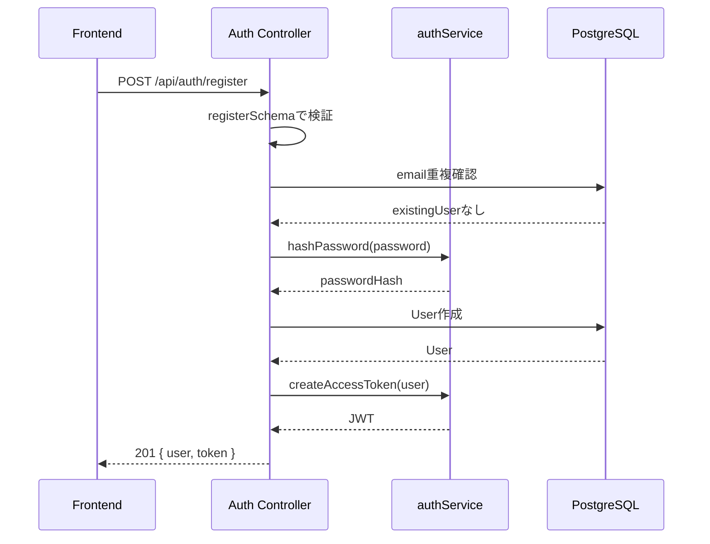
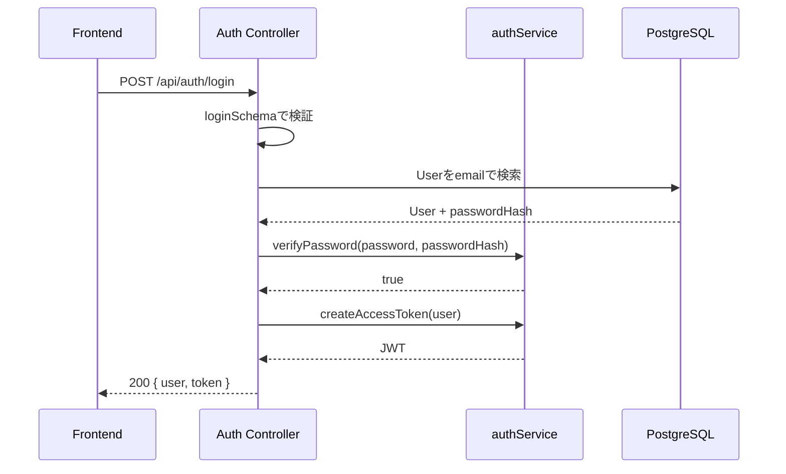
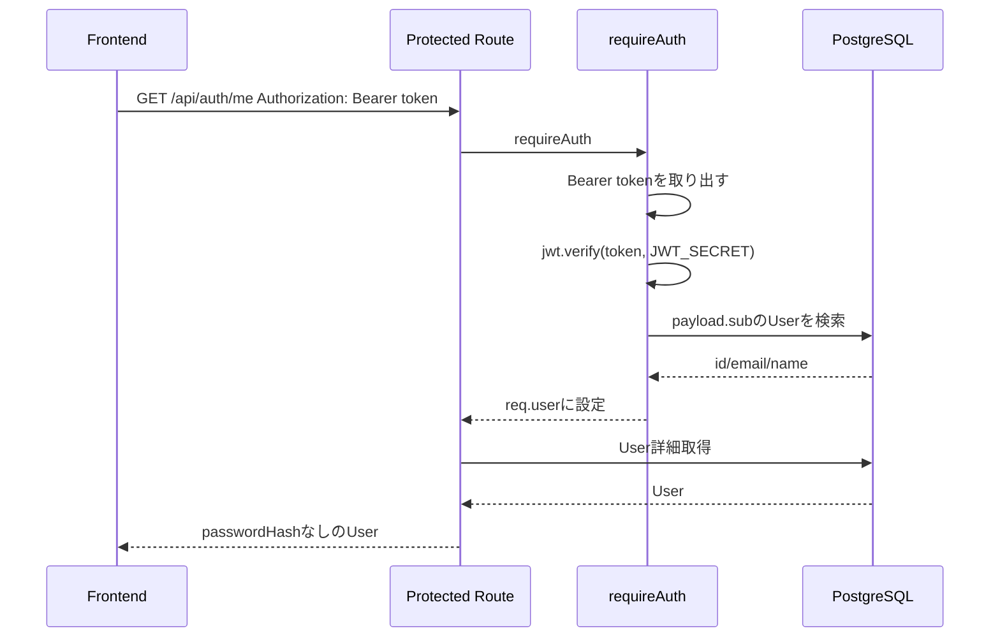

# 06. Auth Flow

## 認証の全体像

Yorimo の認証は email/password によるログインと JWT bearer token で構成されています。

- パスワードは `bcryptjs` でhash化する
- JWTは `jsonwebtoken` で発行する
- JWTの `sub` に `User.id` を入れる
- JWT payloadには `email` を入れる
- 有効期限は `JWT_EXPIRES_IN` で制御し、デフォルトは `7d`
- 認証が必要なAPIでは `Authorization: Bearer <token>` を送る

## ユーザー登録

対象API:

```text
POST /api/auth/register
```

処理:

1. `registerSchema` で入力検証
2. email重複を `prisma.user.findUnique` で確認
3. passwordを `hashPassword` でbcrypt hash化
4. `User` を作成
5. `createAccessToken` でJWT発行
6. `toPublicUser` で `passwordHash` を除外して返却



## ログイン

対象API:

```text
POST /api/auth/login
```

処理:

1. `loginSchema` で入力検証
2. emailで `User` を検索
3. `verifyPassword` で平文passwordと `passwordHash` を照合
4. JWT発行
5. `passwordHash` を除外した `user` と `token` を返却



存在しないemail、またはpassword不一致の場合はどちらも同じメッセージで `UNAUTHORIZED` を返します。

## 認証API呼び出し



`requireAuth` が `req.user` に設定するのは `id`、`email`、`name` です。

## ログイン中ユーザー取得

対象API:

```text
GET /api/auth/me
```

`req.user.id` で `User` を取得し、`passwordHash` を除外して返します。

## プロフィール更新

対象API:

```text
PATCH /api/auth/me
```

更新可能な項目:

- `name`
- `ageRange`
- `homeStation`
- `schoolOrWorkStation`
- `interests`
- `defaultBudgetMin`
- `defaultBudgetMax`

`defaultBudgetMin <= defaultBudgetMax` の制約があります。

## 認証失敗時のエラー

| 条件 | code | message |
| --- | --- | --- |
| Authorization headerなし | `UNAUTHORIZED` | `認証が必要です` |
| token不正 | `UNAUTHORIZED` | `トークンが無効です` |
| tokenのUserが存在しない | `UNAUTHORIZED` | `有効なユーザーが見つかりません` |
| emailまたはpassword不正 | `UNAUTHORIZED` | `メールアドレスまたはパスワードが正しくありません` |

## 認可の考え方

実装済み:

- 自分のRouteだけ一覧、詳細、更新、削除できる
- 推薦条件に使える `routeId` は自分のRouteだけ
- 自分のPostだけ更新、削除できる
- `SavedSpot` は `req.user.id` と `spotId` の複合キーで自分の保存だけ操作する
- `GET /api/feed` ではブロック関係にあるユーザーの投稿を除外する

未実装または今後の想定:

- 管理者ロール
- spot作成、更新、削除の管理者制限
- refresh token
- logout、token失効リスト
- パスワードリセット
- メール認証
- フォロー関係に基づく `followers` visibility
