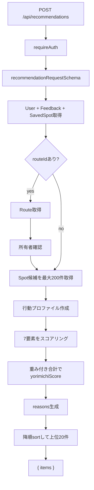
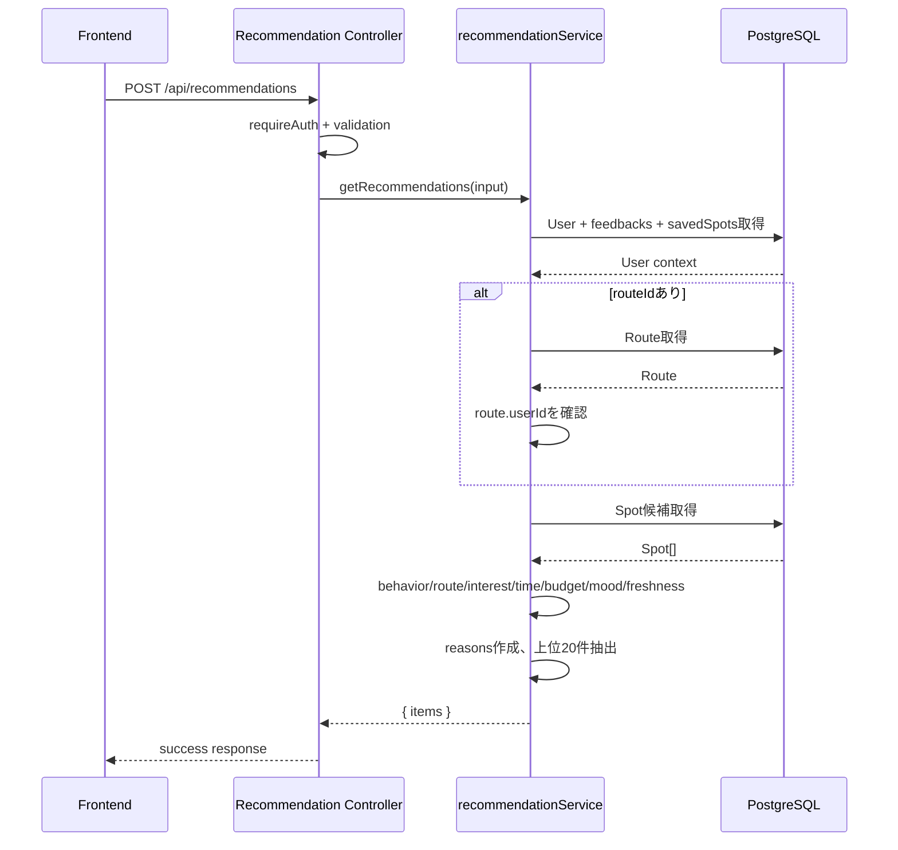
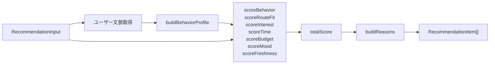

# 07. Recommendation Flow

## 推薦APIの目的

`POST /api/recommendations` は、Yorimo の中心機能である「寄り道推薦」を返すAPIです。ユーザーの現在地、マイルート、空き時間、予算、気分、興味、過去の反応を組み合わせ、スポットごとに `yorimichiScore` と `reasons` を返します。

現在は `src/services/recommendationService.ts` にMVPのルールベース実装があります。AI、ベクトル検索、外部地図APIは未実装です。

## 入力データ

| フィールド | 必須 | 説明 |
| --- | --- | --- |
| `currentLat` | 必須 | 現在地の緯度 |
| `currentLng` | 必須 | 現在地の経度 |
| `routeId` | 任意 | 推薦に使う自分のRoute |
| `availableMinutes` | 必須 | 寄り道に使える時間 |
| `budgetMin` | 任意 | 予算下限 |
| `budgetMax` | 任意 | 予算上限 |
| `mood` | 任意 | 今の気分。日本語キーワードから推定タグを生成 |
| `interestTags` | 任意 | その場で指定する興味タグ |

`budgetMin <= budgetMax` の制約があります。`routeId` が他人のRouteの場合は `FORBIDDEN` です。

## 使用するユーザーデータ

実装済みで使っているデータ:

- `User.interests`
- `User.defaultBudgetMin`
- `User.defaultBudgetMax`
- `Feedback` 最新100件
- `Feedback.spot.category`
- `Feedback.spot.tags`
- `SavedSpot.spot.category`
- `SavedSpot.spot.tags`
- 指定された `Route`

未実装または今後の想定:

- プロフィールの年齢帯を使った年齢不適切スポット除外
- 投稿履歴を直接使った推薦
- フォロー関係や友人の訪問傾向
- リアルタイム混雑、営業時間、休業日
- 外部地図APIの移動時間

## スポット候補の抽出方法

現在の実装:

1. `prisma.spot.findMany({ orderBy: { createdAt: "desc" }, take: 200 })` で最大200件取得
2. 取得した全候補に対してスコアを算出
3. `yorimichiScore` 降順にsort
4. 上位20件を返す

現在はDB側で距離、カテゴリ、営業時間などの事前絞り込みはしていません。スポット数が増えた場合は、DB側の地理検索、カテゴリ絞り込み、営業時間フィルタを入れるべきです。

## 寄り道スコアの計算方法

`yorimichiScore` は7要素の加重平均です。

| 要素 | 重み | 実装内容 |
| --- | --- | --- |
| 行動パターン一致度 `behavior` | 25% | FeedbackとSavedSpotからカテゴリ・タグの好みを加点または減点 |
| ルート適合度 `route` | 20% | 現在地からの距離、routeIdがあればRoute線分からの距離を評価 |
| 趣味一致度 `interest` | 15% | `User.interests` と入力 `interestTags` がSpotのcategory/tagsに一致する割合 |
| 時間適合度 `time` | 15% | `averageStayMinutes` が `availableMinutes` に収まるか |
| 予算適合度 `budget` | 10% | Spotの価格帯が入力またはデフォルト予算に収まるか |
| 気分一致度 `mood` | 10% | `mood` から直接語と推定タグを作り、Spot情報に含まれるか |
| 新鮮度 `freshness` | 5% | Spot作成日が新しいほど高い |

スコアは `clampScore` により 0 から 100 に丸められます。

## 行動パターン一致度

Feedbackの重み:

| action | 重み |
| --- | --- |
| `view` | +1 |
| `save` | +4 |
| `visited` | +5 |
| `like` | +4 |
| `skip` | -2 |
| `dislike` | -4 |
| `report` | -5 |

SavedSpotはカテゴリと各タグに +5 します。履歴がない場合の `behavior` は50です。

## ルート適合度

routeIdなし:

- 現在地からSpotまでの距離で評価

routeIdあり:

- 現在地からSpotまでの距離スコア
- Routeの始点終点を結ぶ線分からSpotまでの距離スコア
- 現在地45%、ルート55%で合成

距離計算は `src/utils/geo.ts` の `distanceKm` と `distancePointToSegmentKm` です。

## 気分一致度

`moodKeywords` は入力文を空白や句読点で分割し、さらに日本語キーワードから推定タグを追加します。

例:

- 「甘い」「スイーツ」「デザート」なら `スイーツ`, `カフェ`
- 「静」「勉強」「作業」なら `静かな場所`, `勉強場所`, `カフェ`
- 「運動」「汗」「整」なら `ジム`, `サウナ`
- 「買」「服」なら `買い物`, `古着`
- 「映画」なら `映画`

## 推薦理由 reasons の作り方

`buildReasons` は各スコアが70以上の場合に理由を追加します。

- route >= 70: `現在地または登録ルートから近い`
- budget >= 70 かつ有効な予算上限あり: `予算X円以内に収まりやすい`
- interest >= 70: `興味タグと相性がよい`
- behavior >= 70: `カテゴリ系スポットへの過去の反応が良い`
- time >= 70: `availableMinutes分以内の寄り道にちょうどいい`
- mood >= 70 かつ moodあり: `今の気分に合うキーワードが含まれている`

該当がない場合は `条件に対してバランスよく一致している` を返します。

## 推薦処理のflowchart

## 推薦APIのsequenceDiagram

## recommendationServiceの責務図

## 将来AI推薦に置き換える場合

段階的な設計案:

1. 現在の `scoreBreakdown` と `reasons` を保持したまま、候補抽出だけ地理検索にする
2. `RecommendationLog` を追加し、表示、クリック、保存、訪問を学習データにする
3. `Spot`、`Post`、`Feedback`、`User.interests` をembedding化してベクトル検索を追加する
4. ルールベースの `yorimichiScore` をAIスコアと合成する
5. AIが返す推薦理由を安全なテンプレートに変換して表示する
6. 未成年配慮、ブロック、通報対象除外をAIの前段フィルタとして必ず残す
