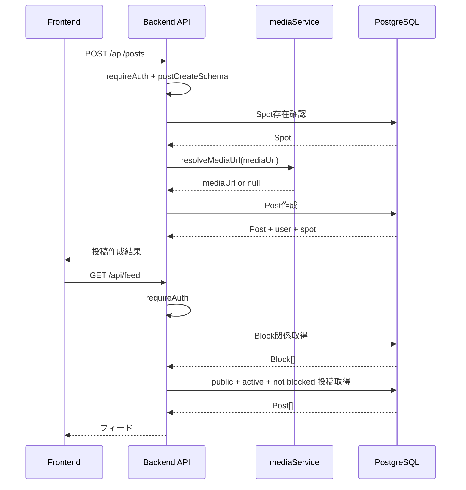

# 08. Posting SNS Flow

## 投稿機能の目的

Yorimo の投稿機能は、地図上のスポットにSNS投稿を紐づけるための機能です。ユーザーはスポットに対して、写真、ショート動画、ストーリー、一言レビューを投稿できます。

現在の実装では、投稿データと `mediaUrl` の保存は実装済みです。画像・動画ファイルのアップロード、サムネイル生成、ストレージ連携は未実装です。

## 投稿作成

対象API:

```text
POST /api/posts
```

認証必須です。処理の流れ:

1. `requireAuth`
2. `postCreateSchema` で入力検証
3. `spotId` のSpot存在確認
4. `mediaService.resolveMediaUrl` で `mediaUrl` を解決
5. `type=story` かつ `expiresAt` 未指定なら24時間後を自動設定
6. `Post` 作成
7. `user` と `spot` をincludeして返却

## 投稿取得

対象API:

- `GET /api/posts`
- `GET /api/posts/:id`

どちらも認証必須です。取得対象は以下です。

- `expiresAt` が `null`
- または `expiresAt` が現在時刻より未来
- かつ `visibility=public`
- または投稿者が自分

つまり、`private` と `followers` は現時点では投稿者本人だけが読めます。フォロー関係に基づく表示は未実装です。

## スポット詳細に紐づく投稿

対象API:

```text
GET /api/spots/:id/posts
```

認証不要です。指定Spotに紐づく投稿のうち、`visibility=public` かつ期限切れでない投稿を最大50件返します。

## フィード表示

対象API:

```text
GET /api/feed
```

認証必須です。処理:

1. 自分がブロックしたユーザー、自分をブロックしたユーザーを `Block` から取得
2. `visibility=public` の投稿だけを対象にする
3. `expiresAt` が `null` または未来の投稿だけを対象にする
4. ブロック関係のユーザー投稿を除外
5. `createdAt desc` で最大50件返す

## 投稿タイプ

| type | 意味 | 現在の実装 |
| --- | --- | --- |
| `photo` | 写真投稿 | `mediaUrl` に画像URLを保存 |
| `short_video` | ショート動画 | `mediaUrl` に動画URLを保存 |
| `story` | 一時的な投稿 | `expiresAt` で期限管理。未指定なら24時間後 |
| `review` | 一言レビュー | `caption`、`rating`、`moodTags` などを保存 |

## mediaUrlの扱い

`mediaUrl` は `z.string().url().nullable().optional()` で検証されます。

`mediaService.resolveMediaUrl` の現在の実装:

```ts
export const resolveMediaUrl = async ({ mediaUrl }: MediaInput) => {
  return mediaUrl ?? null;
};
```

つまり、現時点ではアップロード処理やURL変換はありません。将来S3やCloudinaryに置き換えるための差し替えポイントです。

## storyのexpiresAt

- リクエストで `expiresAt` が指定されていればその値を保存
- `type=story` かつ `expiresAt` が未指定なら、作成時点から24時間後を保存
- `GET /api/posts`、`GET /api/posts/:id`、`GET /api/spots/:id/posts`、`GET /api/feed` では期限切れ投稿を除外

## visibility

| visibility | 現在の扱い |
| --- | --- |
| `public` | フィード、スポット投稿一覧、他ユーザーの投稿一覧に表示される |
| `followers` | enumとvalidationはあるが、フォロー機能未実装のため本人以外には表示されない |
| `private` | 本人だけが `/api/posts` や `/api/posts/:id` で取得できる |

## 投稿とスポットの関係

- `Post.spotId` は `Spot.id` への外部キー
- Spot削除時はPostもcascade削除
- 投稿作成時はSpot存在確認を行う
- Spot詳細の投稿一覧は `GET /api/spots/:id/posts` で取得

## 投稿とユーザーの関係

- `Post.userId` は `User.id` への外部キー
- User削除時はPostもcascade削除
- 投稿更新、削除は `post.userId === req.user.id` の場合のみ許可

## 投稿作成からフィード表示まで



## 将来S3やCloudinaryに置き換える場合

`mediaService` の責務を以下に拡張できます。

- クライアントからの直接アップロード用署名付きURL発行
- アップロード完了後のURL検証
- 画像、動画のContent-Typeとサイズ検証
- サムネイルURLの生成
- 不適切画像検出やウイルススキャンとの連携
- `Post.mediaUrl` だけでなく `MediaAsset` テーブルへの保存
- 投稿削除時のストレージ上のファイル削除
