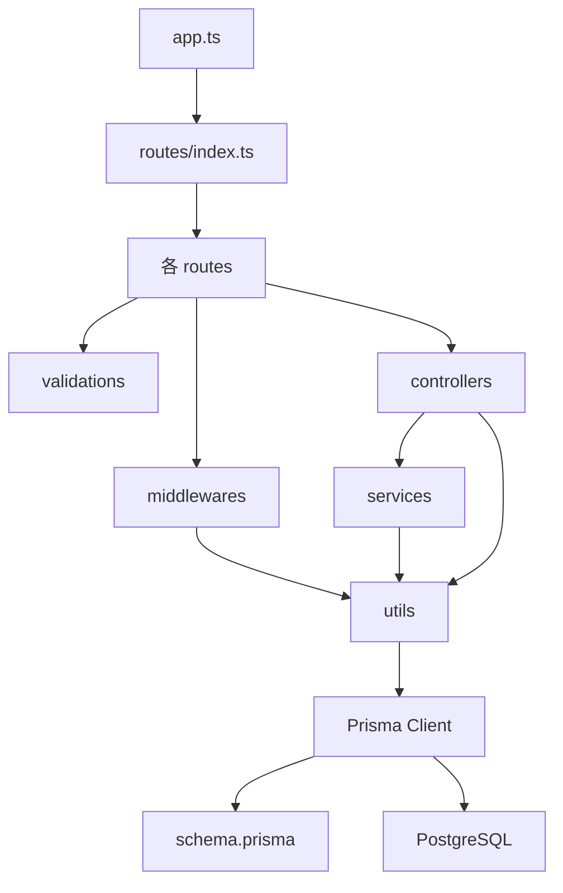
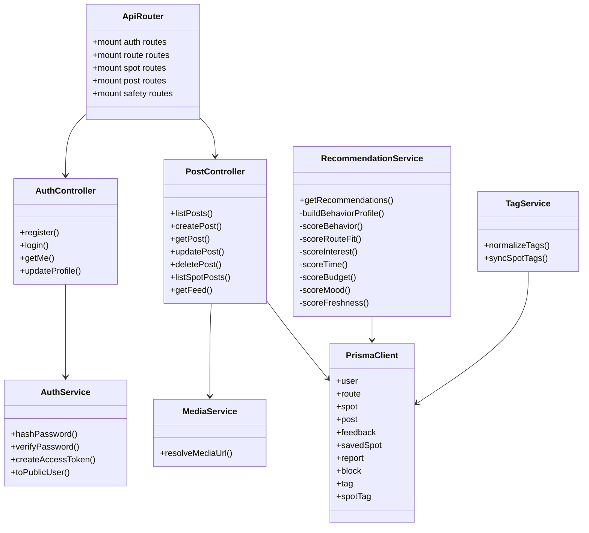

# 09. Class and Module Diagram

このプロジェクトはTypeScript / Expressの関数ベース構成です。厳密なクラス設計ではなく、routes、controllers、services、middlewares、validations、utils、Prisma Clientのモジュール責務として整理します。

## 主要モジュール一覧

| 分類 | 実装済みモジュール |
| --- | --- |
| app/server | `src/app.ts`, `src/server.ts` |
| routes | `authRoutes`, `routeRoutes`, `spotRoutes`, `recommendationRoutes`, `postRoutes`, `feedbackRoutes`, `savedSpotRoutes`, `safetyRoutes`, `index` |
| controllers | `authController`, `routeController`, `spotController`, `recommendationController`, `postController`, `feedbackController`, `savedSpotController`, `safetyController` |
| services | `authService`, `recommendationService`, `mediaService`, `tagService` |
| middlewares | `auth`, `validate`, `errorHandler`, `notFound` |
| validations | `authValidation`, `routeValidation`, `spotValidation`, `recommendationValidation`, `postValidation`, `feedbackValidation`, `safetyValidation`, `common` |
| utils | `apiResponse`, `asyncHandler`, `errors`, `geo`, `prisma` |
| config | `env`, `openapi` |
| types | `express.d.ts` |

## モジュール依存関係

## routesの責務

- URL prefixとHTTP methodを定義する
- 認証が必要なrouteに `requireAuth` を適用する
- body、query、paramsにZod validationを適用する
- controllerを `asyncHandler` で包む

例:

- `postRouter.use(requireAuth)` により `/api/posts` 配下はすべて認証必須
- `spotRouter.get("/")` と `spotRouter.get("/:id")` は認証不要
- `spotRouter.post("/")`、`patch`、`delete` は認証必須

## controllersの責務

- `req.body`、`req.query`、`req.params`、`req.user` を使って処理する
- Prisma ClientでDB操作する
- 必要なserviceを呼ぶ
- `notFound`、`forbidden`、`conflict` などのAppErrorを投げる
- `sendSuccess` でレスポンスを返す

現在は一部の業務ロジックがcontrollersに残っています。例えば `routeController`、`spotController`、`savedSpotController` はservice層を介さずPrismaを直接使います。

## servicesの責務

### authService

実装済み:

- `hashPassword`
- `verifyPassword`
- `createAccessToken`
- `toPublicUser`

パスワードhash化、JWT発行、公開User変換を担当します。

### recommendationService

実装済み:

- ユーザー文脈取得
- Route所有者確認
- 行動プロファイル作成
- スポット候補取得
- 7要素のスコアリング
- `yorimichiScore` と `reasons` 生成

### mediaService

実装済み:

- `resolveMediaUrl`

現時点では `mediaUrl ?? null` を返すだけです。将来のストレージ連携の差し替え口です。

### tagService

実装済み:

- `normalizeTags`
- `syncSpotTags`

Spot作成・更新時にタグ文字列を正規化し、`Tag` と `SpotTag` を同期します。

## 未実装のserviceと現在の置き場所

| service名 | 状態 | 現在の実装場所 |
| --- | --- | --- |
| `userService` | 未実装 | `authController` の `getMe`、`updateProfile` |
| `routeService` | 未実装 | `routeController` |
| `spotService` | 未実装 | `spotController` |
| `postService` | 未実装 | `postController` |
| `feedbackService` | 未実装 | `feedbackController` |
| `savedSpotService` | 未実装 | `savedSpotController` |
| `reportService` | 未実装 | `safetyController.createReport` |
| `blockService` | 未実装 | `safetyController.blockUser`、`unblockUser` |

## middlewaresの責務

| middleware | 責務 |
| --- | --- |
| `requireAuth` | JWT検証、User存在確認、`req.user` 設定 |
| `validateBody` | request bodyをZodでparse |
| `validateQuery` | queryをZodでparse |
| `validateParams` | paramsをZodでparse |
| `errorHandler` | ZodError、AppError、Prisma errorを共通エラー形式に変換 |
| `notFoundHandler` | 未定義pathを404に変換 |

## validationsの責務

API境界で受け付ける値を定義します。主な制約:

- email形式
- password長
- 緯度経度範囲
- 予算の大小関係
- 投稿タイプ、公開範囲、通報理由のenum
- paginationの `limit` と `offset`

## utilsの責務

| util | 責務 |
| --- | --- |
| `apiResponse` | 成功、エラーの共通レスポンス |
| `asyncHandler` | async controllerの例外をExpress error handlerへ渡す |
| `errors` | `AppError` とHTTPエラー生成関数 |
| `geo` | 現在地とルート線分からの距離計算 |
| `prisma` | Prisma Client singleton |

## Prisma Clientの責務

- `schema.prisma` から生成される型安全なDB client
- controllers/servicesからDBへアクセスする窓口
- relation include、transaction、findMany、upsertなどを提供

## クラス図的な表現

Mermaidの `classDiagram` では関数ベースモジュールを便宜上classとして表現しています。実際のコードはclassではなくexport関数です。
