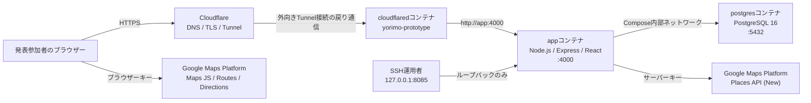

# 自宅サーバー公開構成・運用手順

## 1. 目的と適用範囲

この文書は、Yorimoの発表用プロトタイプを自宅サーバーから `https://yorimo.mu-natuki.com/` で公開する構成と、SSHによる手動運用手順をまとめたものです。

対象は `/home/natuki/services/yorimo` に配置したComposeプロジェクト `yorimo` です。既存のWebサービス、既存のDockerボリューム、systemdで稼働する共用版`cloudflared`、ルーター設定は対象外です。

最終確認日: 2026年7月13日（JST）

## 2. サーバー概要

| 項目 | 確認値・設定 |
| --- | --- |
| SSH接続名 | `home-server` |
| OS | Ubuntu 24.04.4 LTS |
| Kernel | `6.8.0-111-generic` |
| Docker | 29.4.1 |
| Docker Compose | v5.1.3 |
| メモリ | 31GiB、確認時available約22GiB |
| Swap | 8GiB |
| ルートディスク | 98GB中71GB使用、空き23GB、使用率77% |
| 配置先 | `/home/natuki/services/yorimo` |
| デプロイブランチ | `agent/deploy-home-server` |
| 確認時デプロイSHA | `cc63a1196144a2042d76b73521dfdb80f87a2300` |
| 公開URL | `https://yorimo.mu-natuki.com/` |
| ローカル確認URL | `http://127.0.0.1:8085/` |

SHA、空き容量、イメージ作成時刻は更新のたびに変わるため、作業前に再確認してください。

## 3. 全体構成



Cloudflare Tunnelは自宅サーバーから外向きに接続します。Yorimoのためのルーターポート開放はありません。Cloudflareからアプリへの転送先はCompose内部の `http://app:4000` です。

## 4. Docker Compose構成

定義元は [`compose.production.yml`](../compose.production.yml) です。

### 4.1 `postgres`

| 項目 | 設定 |
| --- | --- |
| イメージ | `postgres:16-alpine` |
| 再起動 | `unless-stopped` |
| DB名・ユーザー | 環境変数、既定値はともに`yorimo` |
| 永続化 | `yorimo_postgres-data` ボリューム |
| ヘルスチェック | `pg_isready`、5秒間隔、最大20回 |
| 公開ポート | なし |
| 接続元 | `app-network` 内の`app`のみ |

ホストの5432番は待ち受けていません。DBへ直接接続する場合も、原則としてコンテナ内またはComposeネットワーク経由で行います。

### 4.2 `app`

| 項目 | 設定 |
| --- | --- |
| ビルド | リポジトリの[`Dockerfile`](../Dockerfile) |
| ビルド環境 | `node:20-alpine` |
| アプリポート | コンテナ内`4000` |
| ホスト公開 | `127.0.0.1:8085:4000` |
| 起動処理 | `prisma migrate deploy`後に`dist/src/server.js`を起動 |
| ヘルスチェック | `http://127.0.0.1:4000/ready` |
| 依存関係 | `postgres`がhealthyになってから起動 |
| 再起動 | `unless-stopped` |
| 権限保護 | `no-new-privileges:true`、`init:true` |

バックエンドAPIとReact/Viteの静的ファイルは同じ`app`コンテナから配信します。ブラウザー用Google Mapsキーはビルド時にフロントエンドへ組み込まれるため、キーを変更した場合は`app`の再ビルドが必要です。

### 4.3 `cloudflared`

| 項目 | 設定 |
| --- | --- |
| イメージ | `cloudflare/cloudflared:2026.7.1` |
| Compose profile | `public` |
| Tunnel | `yorimo-prototype` |
| 転送先 | `http://app:4000` |
| 認証 | `/run/secrets/cloudflared_token`のtoken-file |
| 起動条件 | `app`がhealthyになってから起動 |
| 自動更新 | 無効、イメージタグで固定 |
| 再起動 | `unless-stopped` |
| 権限保護 | `no-new-privileges:true` |

ホスト側のトークンを`0600`のまま読み込むため、この専用コンテナだけ`root`で起動します。Yorimo用コンテナと、稼働中のsystemd版`cloudflared`は別物です。systemd版の停止、設定変更、再起動はこの運用に含めません。

### 4.4 ネットワークと永続データ

| 種類 | 実体 |
| --- | --- |
| Composeネットワーク | `yorimo_app-network`（bridge） |
| PostgreSQLボリューム | `yorimo_postgres-data` |
| Cloudflareトークン | `./secrets/cloudflared-token` |
| 本番環境変数 | `./.env.production` |

`.env.production`と`secrets/cloudflared-token`は所有者だけが読める`0600`で配置します。値はGitへ追加しません。

## 5. 外部サービス構成

### 5.1 Cloudflare

| 項目 | 設定 |
| --- | --- |
| Zone | `mu-natuki.com` |
| Tunnel | `yorimo-prototype` |
| Published application hostname | `yorimo.mu-natuki.com` |
| Service | `http://app:4000` |
| Cloudflare Access | なし |
| 利用者の入口 | `https://yorimo.mu-natuki.com/` |

QRコードから直接利用するためAccessログインは付けません。即時非公開にする場合は、サーバー停止より先にCloudflareのPublished application routeまたは対応DNSを外します。

### 5.2 Google Maps Platform

Google Cloudプロジェクトは`yorimo-presentation`です。

| キー | 用途 | アプリケーション制限 | API制限 |
| --- | --- | --- | --- |
| Browser Key | 地図・経路表示 | `https://yorimo.mu-natuki.com/*` | Maps JavaScript API、Routes API、Directions API |
| Server Key | 実店舗検索・画像 | サーバー環境変数のみ | Places API (New) |

経路表示はRoutes APIを優先します。日本の公共交通経路が返らない場合はDirections APIへフォールバックし、発表用の東京駅―新宿駅ルートは同梱した鉄道形状でも表示できます。ブラウザーキーは公開バンドルに含まれる前提なので、HTTPリファラーとAPIの両制限を外さないでください。

予算は月額3,000円、通知は50%、90%、100%で設定しています。APIやキーを追加する場合は、用途、制限、予算への影響をこの文書にも反映します。

## 6. 本番環境変数

雛形は [`.env.production.example`](../.env.production.example) です。実値は記録せず、変数名と目的だけを管理します。

| 分類 | 変数 |
| --- | --- |
| 実行環境 | `NODE_ENV`、`PORT` |
| PostgreSQL | `POSTGRES_DB`、`POSTGRES_USER`、`POSTGRES_PASSWORD` |
| JWT | `JWT_SECRET`、`JWT_EXPIRES_IN` |
| デモ | `DEMO_MODE`、`ALLOW_DEMO_RESET` |
| 公開制御 | `EXPOSE_API_DOCS`、`CORS_ORIGINS` |
| レート制限 | `DEMO_LOGIN_RATE_LIMIT`、`DEMO_MUTATION_RATE_LIMIT`、`RECOMMENDATION_RATE_LIMIT` |
| Google | `GOOGLE_MAPS_SERVER_API_KEY`、`VITE_GOOGLE_MAPS_API_KEY` |

公開時の重要値は次のとおりです。

- `NODE_ENV=production`
- `DEMO_MODE=true`
- `ALLOW_DEMO_RESET=false`
- `EXPOSE_API_DOCS=false`
- `CORS_ORIGINS=https://yorimo.mu-natuki.com`
- JWTの有効期限は8時間
- デモログイン90回、一般変更600回、推薦180回を各10分単位で制限

## 7. セキュリティ境界

- 外部公開はCloudflare Tunnelだけを利用し、ルーターのポートを開けない。
- ホスト公開は`127.0.0.1:8085`だけで、LANやインターネットへ直接bindしない。
- PostgreSQLはホストへ公開しない。
- `/api-docs`と`/openapi.json`は本番で404にする。
- CORSは`https://yorimo.mu-natuki.com`だけを許可する。
- APIレスポンスは原則`Cache-Control: no-store`とし、Place Photoのキャッシュ可能なリダイレクトだけを例外とする。
- `.env.production`、Tunnelトークン、PostgreSQLボリュームをGitや発表資料へ含めない。
- Tunnel、Googleキー、DBデータは発表終了後に削除する。

## 8. SSH運用手順

以降のコマンドは、SSH接続後にデプロイディレクトリで実行します。

```bash
ssh home-server
cd /home/natuki/services/yorimo
```

すべてのCompose操作で`--env-file .env.production`を明示します。

### 8.1 状態確認

```bash
git status --short
git rev-parse HEAD
docker compose -p yorimo --env-file .env.production -f compose.production.yml --profile public ps
docker compose -p yorimo --env-file .env.production -f compose.production.yml logs --tail=100 app
curl -fsS http://127.0.0.1:8085/health
curl -fsS http://127.0.0.1:8085/ready
```

期待値は`app`と`postgres`がhealthy、`cloudflared`がUp、`/health`と`/ready`が200です。`/ready`はDB接続とデモfixtureの存在も確認します。

### 8.2 更新と再ビルド

作業ツリーがcleanであることを確認してから更新します。

```bash
git pull --ff-only origin agent/deploy-home-server
docker compose -p yorimo --env-file .env.production -f compose.production.yml build app
docker compose -p yorimo --env-file .env.production -f compose.production.yml up -d postgres app
```

`app`がhealthyになった後にローカル確認を行います。Dockerfileの起動コマンドが`prisma migrate deploy`を実行するため、通常の更新で別途マイグレーションコマンドを実行する必要はありません。

初回構築時またはfixtureを追加したときだけ、シードを明示的に実行します。

```bash
docker compose -p yorimo --env-file .env.production -f compose.production.yml exec app \
  node dist/prisma/seed.js
```

### 8.3 公開開始

Cloudflare管理画面でTunnelとPublished application routeが正しいことを確認してから起動します。

```bash
docker compose -p yorimo --env-file .env.production -f compose.production.yml \
  --profile public up -d cloudflared
```

その後、Wi-Fiを切ったスマートフォンから次を確認します。

- HTTPS証明書が有効である。
- Accessログインなしでトップページを開ける。
- 共有デモ、登録、ログイン、地図、経路、保存、口コミ、ルート作成が動く。
- `/api-docs`と`/openapi.json`が404である。

### 8.4 発表直前のデータリセット

リセットスクリプトは`DEMO_MODE=true`、`ALLOW_DEMO_RESET=true`、`--confirm`の3条件を要求します。本番の常設値は`ALLOW_DEMO_RESET=false`のままにし、必要な1回だけ`docker compose exec -e`で上書きします。

```bash
docker compose -p yorimo --env-file .env.production -f compose.production.yml exec \
  -e ALLOW_DEMO_RESET=true app node dist/prisma/resetDemo.js --confirm
```

リセット後は`/ready`と主要機能を確認し、スモークテストで作成したデータを残さないよう、公開開始直前にもう一度リセットします。

### 8.5 非公開化と停止

1. CloudflareのPublished application routeまたは対応DNSを先に削除する。
2. 携帯回線から公開URLへ到達できないことを確認する。
3. Yorimo専用`cloudflared`を停止する。
4. `app`と`postgres`を停止する。
5. 発表終了が確定したらGoogleキー、API、Tunnelトークン、`.env.production`、PostgreSQLボリュームを削除する。

```bash
docker compose -p yorimo --env-file .env.production -f compose.production.yml \
  --profile public stop cloudflared
docker compose -p yorimo --env-file .env.production -f compose.production.yml \
  --profile public stop app postgres
```

ボリューム削除は復元できないため、Cloudflare routeを外す停止訓練では実行しません。

## 9. 障害時の確認順

### 公開URLが502または到達不能

1. Cloudflareの`yorimo-prototype`がHealthyか確認する。
2. `cloudflared`コンテナがUpか確認する。
3. `app`がhealthyか確認する。
4. `curl http://127.0.0.1:8085/ready`を確認する。
5. `app`と`cloudflared`の直近ログを確認する。

### `/ready`が失敗する

1. `postgres`のhealthとログを確認する。
2. `DATABASE_URL`を値を表示せずに設定有無だけ確認する。
3. マイグレーションの失敗がないか`app`ログを確認する。
4. 必要に応じて`seed.js`を再実行する。

### 地図・店舗・経路が表示されない

1. ブラウザー開発者ツールでGoogle MapsのAPI制限エラーを確認する。
2. Browser KeyのHTTPリファラーと3 API制限を確認する。
3. Server KeyがPlaces API (New)だけに制限されていることを確認する。
4. Google Cloudのクォータと予算通知を確認する。
5. 東京駅―新宿駅の発表用経路は同梱形状へフォールバックすることを確認する。

## 10. 変更時のチェックリスト

- [ ] Compose、Dockerfile、環境変数例とこの文書が一致している。
- [ ] 秘密値がGit差分に含まれていない。
- [ ] バックエンドテスト、フロントエンドテスト、TypeScript/Viteビルドが成功する。
- [ ] `app`と`postgres`がhealthyになる。
- [ ] 8085番が`127.0.0.1`だけで待ち受ける。
- [ ] ホストの5432番が待ち受けていない。
- [ ] 既存のsystemd版`cloudflared`へ影響がない。
- [ ] 公開URL、HTTPS、QRコード、主要機能を携帯回線で確認する。
- [ ] デプロイSHAと確認日を更新する。
